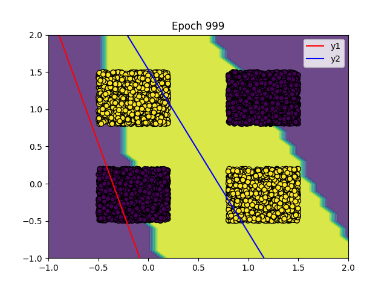

# XOR Neural Network Simulator (Manual Implementation)

本專案以純數學公式推導的方式，從零實作出一個能學習 XOR 邏輯的神經網路模型。  
訓練過程不依賴任何深度學習套件（如 TensorFlow、PyTorch），而是完全按照反向傳播（Backpropagation）與梯度下降（Gradient Descent）公式自行計算與更新權重。

---

## 專案簡介
XOR（Exclusive OR）是機器學習中最經典的非線性分類問題之一。  
本專案的目標是展示神經網路如何藉由數學公式與權重更新機制，學會區分 XOR 的輸出結果。

---

## 模型架構
- 輸入層 (Input layer)：2 個節點（x₁, x₂）  
- 隱藏層 (Hidden layer)：2 個節點（使用 sigmoid 激活函數）  
- 輸出層 (Output layer)：1 個節點（輸出 0 或 1）  
- 損失函數：均方誤差 (Mean Squared Error, MSE)  
- 正則化項：L2 Regularization (λ)

---

## 訓練原理
所有權重與偏差的更新均依據梯度下降（Gradient Descent）公式：

**W = W - η · ∂L/∂W**  
**b = b - η · ∂L/∂b**

其中：
- **η**：學習率  
- **L**：損失函數（Mean Squared Error, MSE）  
- **∂L/∂W**：由反向傳播 (Backpropagation) 推導出的梯度  

激活函數與導數：  
σ(x) = 1 / (1 + e<sup>−x</sup>)  
σ′(x) = σ(x) · (1 − σ(x))

損失函數定義為：  
L = ½ · Σ (y<sub>pred</sub> − y<sub>true</sub>)²

---

## 資料生成與 XOR 判斷邏輯

訓練資料共 10,000 筆樣本：
- 每筆資料的 `(x, y)` 值分佈於兩個區間：
  - `[-0.5, 0.2]` 代表邏輯 0  
  - `[0.8, 1.5]` 代表邏輯 1  

XOR 的分類邏輯為「兩者不同為 1，相同為 0」，具體如下：

| x 所屬區間 | y 所屬區間 | 輸出結果 |
|-------------|-------------|----------|
| 左區間 (0)  | 左區間 (0)  | 0 |
| 左區間 (0)  | 右區間 (1)  | 1 |
| 右區間 (1)  | 左區間 (0)  | 1 |
| 右區間 (1)  | 右區間 (1)  | 0 |

因此，模型的任務是根據 (x, y) 的位置學會這種非線性邊界，完成 XOR 分類。

---

## 視覺化結果
訓練過程可視覺化為：
- 分類決策邊界的動態變化  
- 損失值收斂曲線  
- 權重更新軌跡  


---

## 執行方式
```bash
# 安裝相依套件
pip install numpy matplotlib

# 執行訓練
python xor_train.py
